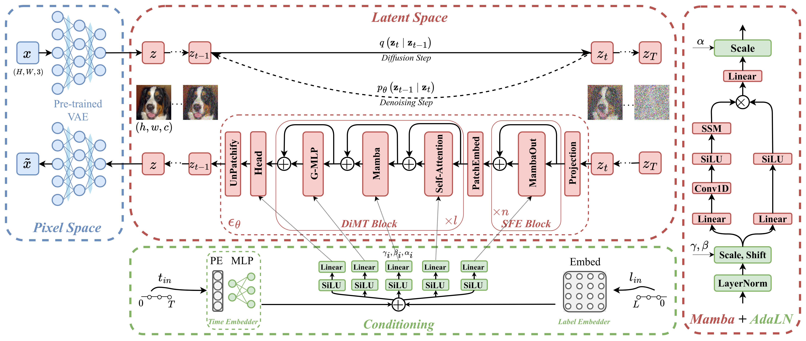

## Enhanced Diffusion Mamba-Transformer (E-DiMT)<br><sub>PyTorch Implementation</sub>



This repo features a benchmark on the joint self-attention and selective state space models for conditional image synthesis using latent diffusion models.

It contains model implementation of:

* [`DiT`](models/dit.py): Diffusion Transformer (baseline)
* [`DiM`](models/dim.py): Diffusion Mamba (ours)
* [`M-DiT`](models/mdit.py): Mamba Diffusion Transformer (ours)
* [`DiMT`](models/dimt.py):  Diffusion Mamba-Transformer (ours)
* [`E-DiMT`](models/edimt.py):  Enhanced Diffusion Mamba-Transformer (ours)

The repository is organised as follows:
  * [Documentation](#documentation)
  * [Folder Structure](#folder-structure)
  * [Setup](#setup)
  * [Extract ImageNet Features](#extract-imagenet-features)
  * [Training](#training)
  * [Sampling](#sampling)
  * [Evaluation](#evaluation) 
 
## Documentation
* This repository is built upon the [fast-DiT](https://github.com/chuanyangjin/fast-DiT), an improved PyTorch implementation of [Scalable Diffusion Models with Transformers (DiT)](https://openaccess.thecvf.com/content/ICCV2023/papers/Peebles_Scalable_Diffusion_Models_with_Transformers_ICCV_2023_paper.pdf).
* Refer to [Vim](https://github.com/hustvl/Vim), as the official implementation of the paper [Vision Mamba: Efficient Visual Representation Learning with Bidirectional State Space Model](https://arxiv.org/abs/2401.09417).
* Refer to [ADM's TensorFlow evaluation suite](https://github.com/openai/guided-diffusion/tree/main/evaluations) for more details about the compute of FID, Inception Score and other metrics.

## Folder Structure
``` 
e-dimt-main
├── diffusion/                    # Diffusion dir
├── docs/                         # Documentation figures
├── evaluator/                    # Evaluator dir
│   └── eval.py                   # Evaluation script
│   └── ...                 
├── mamba/                        # Mamba model dir
├── models/                       # Backbones dir
│   └── layers.py                 # Layers and utility functions
│   └── edimt.py                  # e-dimt backbone
│   └── ...                 
├── extract_features.py           # Feature extraction script
├── requirements.txt              # Requirements
├── sample.py                     # Sampling script 
├── sample_ddp.py                 # DDP sampling script
└── train.py                      # Training script
```

## Setup

First, download and set up the repo:

```bash
git clone https://github.com/ahmedgh970/e-dimt.git
cd EDiMT
```

Then, create a python 3.10 conda env and install the requirements

```bash
conda create --name edimt python=3.10
conda activate edimt
pip install -r requirements.txt
cd mamba
pip install -e .
```

## Extract ImageNet Features

To extract ImageNet-256 features:

```bash
torchrun --nnodes=1 --nproc_per_node=1 extract_features.py --image-size 256 --data-path /path/to/imagenet256 --features-path /path/to/store/features
```

## Training
We provide a training script for E-DiMT model in [`train.py`](train.py). Please modify the necessary import and model definition/name to train a different model from the proposed benchmark.
To launch EDiMT-L/2 (256x256) training with `N` GPUs on one node:

```bash
accelerate launch --multi_gpu --num_processes N --mixed_precision fp16 train.py --model EDiMT-L/2  --image-size 256 --features-path /path/to/store/features
```

## Sampling

To sample from the EMA weights of a trained (256x256) EDiMT-L/2 model, run:

```bash
python sample.py --model EDiMT-L/2 --image-size 256 --ckpt /path/to/model.pt
```

The sampling results will be saved in the model results dir and inside samples dir.

## Evaluation

To samples 50K images from E-DiMT model over `N` GPUs, run:

```bash
torchrun --nnodes=1 --nproc_per_node=N sample_ddp.py --model EDiMT-L/2 --num-fid-samples 50000
```

This script  generates a folder of samples as well as a `.npz` file which can be directly used with [`evaluator/eval.py`](evaluator/eval.py) to compute FID, Inception Score and other metrics, as follows:

```bash
python eval.py /path/to/refernce/batch/.npz /path/to/generated/batch/.npz
...
computing reference batch activations...
computing/reading reference batch statistics...
computing sample batch activations...
computing/reading sample batch statistics...
Computing evaluations...
Inception Score: 215.8370361328125
FID: 3.9425574129223264
sFID: 6.140433703346162
Precision: 0.8265
Recall: 0.5309
```